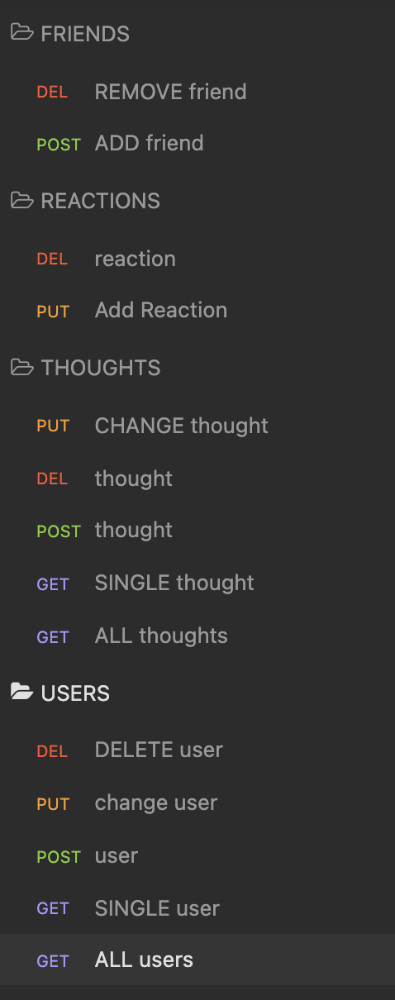

# SocialQue
Social Media backend utilizing mongoDB and the mongoose javascript framework where users can create an account, add friends, and interact

 

### [Link to Video Demonstration](https://www.youtube.com/watch?v=eV3xsYFZkuc&ab_channel=AlessandroBelaj) 

 

## All Associated Routes

## Tools

- Javascript
- Insomnia to test REST API routes 
- Mongoose ODM library
- MongoDB database (noSQL)
- Express.js
